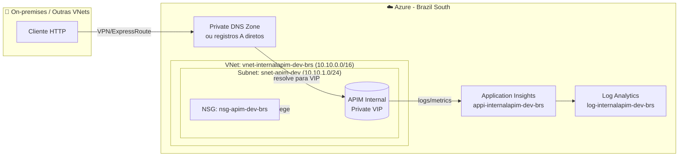

# 2. Arquitetura

## 2.1 Topologia

**Pontos-chave:**
1. O APIM em modo Internal **não expõe** endpoints na internet pública.
2. O **Private VIP** do APIM só é alcançável de dentro da VNet (ou redes peered/conectadas via VPN/ExpressRoute).
3. **DNS** é responsabilidade do cliente — sem registros corretos, nada resolve.
4. **NSG** filtra o tráfego de e para a subnet onde o APIM mora.

## 2.2 Convenção de nomenclatura (CAF)

Seguimos as abreviações oficiais do [Cloud Adoption Framework](https://learn.microsoft.com/en-us/azure/cloud-adoption-framework/ready/azure-best-practices/resource-abbreviations):

| Recurso | Abreviação | Padrão | Exemplo |
|---------|-----------|--------|---------|
| Resource Group | `rg` | `rg-<workload>-<env>-<region>` | `rg-internalapim-dev-brs` |
| Virtual Network | `vnet` | `vnet-<workload>-<env>-<region>` | `vnet-internalapim-dev-brs` |
| Subnet | `snet` | `snet-<purpose>-<env>` | `snet-apim-dev` |
| Network Security Group | `nsg` | `nsg-<purpose>-<env>-<region>` | `nsg-apim-dev-brs` |
| API Management | `apim` | `apim-<workload>-<owner>-<env>` | `apim-internalapim-owner-dev` |
| Log Analytics Workspace | `log` | `log-<workload>-<env>-<region>` | `log-internalapim-dev-brs` |
| Application Insights | `appi` | `appi-<workload>-<env>-<region>` | `appi-internalapim-dev-brs` |
| Public IP (se usado) | `pip` | `pip-<workload>-<env>-<region>` | `pip-internalapim-dev-brs` |

> 💡 O nome do APIM precisa ser **globalmente único** (DNS public). Por isso incluímos o `<owner>` no padrão — evita colisões em ambientes compartilhados.

## 2.3 Decisões de design

### Por que **Internal** e não **External**?
| Cenário | Use Internal | Use External |
|---------|:-----------:|:-----------:|
| APIs internas para consumo interno (intranet, B2B via VPN) | ✅ | ❌ |
| APIs públicas com backend privado | ❌ | ✅ |
| Híbrido (on-prem + cloud via ExpressRoute) | ✅ | ❌ |

### Por que **/24** na subnet?
- Developer_1 ocupa muito pouco IP, mas **/24** dá folga para crescimento e troubleshooting (deploy de jumpboxes na mesma subnet, etc).
- Em **Premium** com várias unidades, calcule **2× capacityUnits + 5** endereços reservados.

### Por que **SystemAssigned Identity**?
- Permite que o APIM acesse Key Vault e outros recursos via RBAC **sem secrets**.
- Configurado por padrão no nosso Terraform.

### NSG — regras mínimas

| Direção | Source | Dest. Port | Propósito |
|---------|--------|-----------|-----------|
| Inbound | `ApiManagement` (service tag) | 3443 | Management endpoint (Portal/PowerShell) |
| Inbound | `AzureLoadBalancer` | 6390 | LB interno do APIM |
| Outbound | → `Storage` | 443 | Dependência core |
| Outbound | → `SQL` | 1433 | Dependência core |
| Outbound | → `AzureKeyVault` | 443 | Dependência core |
| Outbound | → `AzureMonitor` | 443, 1886 | Telemetria |
| Outbound | → `Internet` | 80 | Validação de certificados |

> ❌ Para **Internal mode** você **NÃO precisa** liberar Inbound da Internet 443 nem AzureTrafficManager (essas são apenas para External).

## 2.4 Diferenças External vs Internal (resumo)

| Aspecto | External | Internal |
|---------|----------|----------|
| Endpoints registrados em DNS público | ✅ | ❌ |
| Acessível da internet | ✅ | ❌ |
| Backend privado acessível | ✅ | ✅ |
| Public IP obrigatório | Opcional | Opcional |
| NSG inbound 443 da Internet | ✅ | ❌ |

---

⬅️ Anterior: [Pré-requisitos](01-pre-requisitos.md) | ➡️ Próximo: [Tutorial — Portal Azure](03-tutorial-portal.md)
